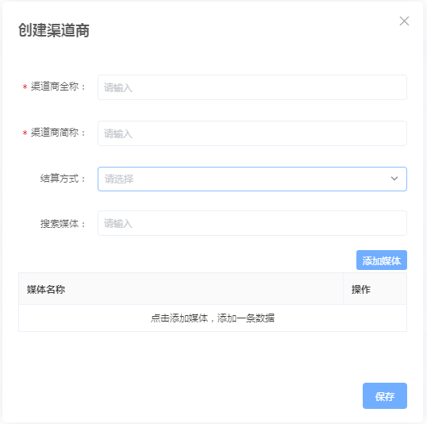

# 渠道管理

## 概述

管理当前主体下所有的渠道，帮助对渠道进行数据统计与合作渠道管理。主要分为两个功能：渠道的创建，渠道商的管理。


建议首先阅读：[渠道相关名词解释](https://doc.skysriver.com/glossary#3-mai-liang-zhu-shou)


## 功能介绍

天幕买量助手的渠道管理分成两级，一级为渠道商，二级为媒体。

* **渠道商**：即合作的公司，例如您与腾讯合作，此时腾讯为合作的渠道商。
* **媒体**：具体的合作产品，即实际的下游戏。例如腾讯使用腾讯桌球与您合作，腾讯桌球即为一个媒体。
* **渠道ID**：每个渠道ID代表一个渠道商-媒体的关系，例如腾讯-腾讯桌球的渠道ID为XXXXXX，腾讯-跳一跳的渠道ID为XXXXXA。 渠道ID是针对渠道商-媒体的唯一ID，可在渠道管理中配置自动生成。

买量助手使用流程：[点击查看](https://cdn.kuaiyugo.com/tianmu/cms/2019-10-18_a5175a00f16611e9aa8c2517a70a9608.jpg)

## 渠道创建

### 渠道的创建与渠道ID的生成

点击【创建渠道】，进入渠道创建的弹窗，进行信息填写，按页面提示信息填写，点击保存后生成渠道ID。

### 渠道信息的发送

点击操作中的发送渠道物料功能后会弹出一个窗口由您确认渠道投放产品等信息是否有误，可点击预览链接查看网页中呈现的信息，确认无误后点击复制链接即可将物料网页发送给合作方。

## 渠道商管理

渠道商管理功能可以帮助管理各种投放渠道的渠道商，不管渠道商再多，也可进行统一管理。

### 渠道商的创建与管理

创建一个渠道商仅需要填写全称、简称，媒体可在需要时添加。


拓展阅读：[渠道商与开放数据管理](https://doc.skysriver.com/channel/main-features/distributor)


