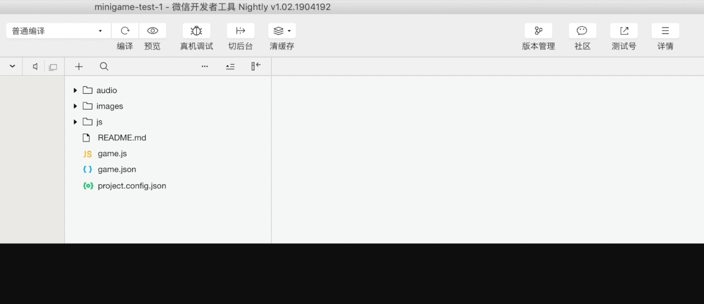

# 为你的游戏接入SDK

## **下载SDK**

下载SDK的流程如下：

1. 请到需要接入的游戏所在的主体的游戏列表中，找到该游戏；
2. 点击游戏名称进入该游戏的后台；
3. 在左侧菜单栏，找到SDK接入，开始SDK接入流程；

#### 注意：

* 请按页面流程完成SDK的下载；
* 请勿多个游戏使用同一个SDK，每个游戏会对应一个单独的SDK；

若还未了解如何下载SDK，请点击[此处](https://skysriver.gitbook.io/skysriver/kai-shi-shi-yong/zuo-wei-liu-liang-zhu-jie-shou-guang-gao-ding-dan/jie-ru-tian-mu-sdk)参阅详细说明。

## **接入SDK**

将下载的sdk文件放置到小游戏工程中，在小游戏game.js中引入SDK，并在需要使用sdk功能的地方调用。

#### 植入方式

1. TypeScript或ES6 JavaScript语法植入方式：import 'tm\_sdk.min.js';
2. ES5 JavaScript使用commonJs规范的植入方式：require\('tm\_sdk.min.js'\);

#### 校验SDK

在植入SDK后，复制屏幕上的检测码，在小程序开发工具中将启动参数设为检测码，并开始编译，天幕将自动检测您的接入是否正常，若您已经设置好参数并完成了编译，请点击“开始检测”按钮进行检测接入状态，即可了解SDK接入是否正常。

编译的操作流程如下：

#### **注意：**

小游戏引入SDK时必须遵守如下事项：

* SDK必须放在主包中加载，切勿分包加载
* 在laya引擎中，文件名必须为.min.js结尾，否则会导致编译报错

## **检查接入状态**

可以通过以下的说明来检查你引入SDK是否成功。

### **微信域名白名单**

使用SDK进行[登录](login/)时，微信开发者工具控制台无以下类似的错误提示： 

若出现此错误，说明未在微信后台配置对应的域名白名单。

**解决办法：** 在微信MP后台配置[域名白名单](https://www.yuque.com/eqrk37/gk0pcl/dg7c7s)

### **登录**

SDK[自动静默登录](login/#jing-mo-deng-lu)后，微信开发者工具控制台无以下类似的错误提示：

出现此错误的主要问题是下载的SDK与当前应用不一致

**解决方法：**请到对应的天幕主体中，查看该主体下的游戏，找到需要接入天幕SDK的游戏，点击游戏名称，进入单个游戏项目后台，再次下载SDK，需确保在需要接入SDK的游戏后台进行下载，请勿在其他游戏后台下载，或是使用其他游戏后台下载的SDK。

