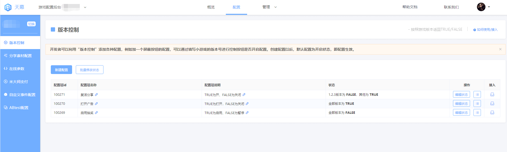
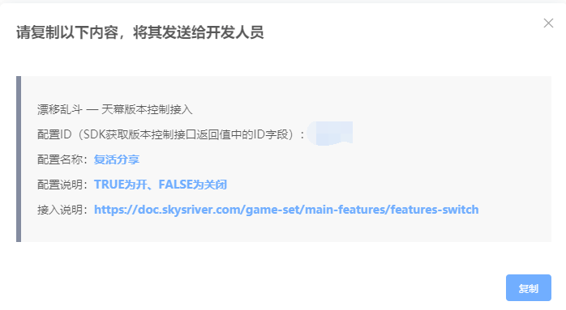

# 版本控制

## **概述**

本篇为版本控制的功能说明，开发请参阅：[版本控制-开发说明](../dev-guide/function-switch.md)

小游戏中的很多功能，建议通过天幕进行云端控制，如微信审核过程中，开发者可以对一些功能进行隐藏，以提高通过审核的成功率。

在审核过程中会关闭的功能或页面元素（常见的）：

* 展示某些广告
* 展示诱导分享的入口
* 开启充值入口

## 实现原理

针对不同版本，返回TRUE/FALSE，前端根据返回值的不同，进行不同的处理（如返回TRUE是展示广告、返回FALSE是关闭广告）。


接入时，请与开发人员约定好TRUE和FALSE的具体含义，同时建议在配置项说明中，申明TRUE/FALSE的含义，避免出现管理上的混乱


## 使用说明

### 创建配置

点击“新建配置”按钮，在弹出的页面填入配置名称、配置项说明。

建议在配置项说明中，申明该配置项在前端TRUE/FALSE的含义

### **配置项状态**

配置项共有三种状态：

1. 全部版本为TRUE
2. 全部版本为FALSE
3. 指定版本为FALSE，其他为TRUE

#### 示例

> 配置项“首页复活分享”，用于控制某功能入口的展示，TRUE为展示，FALSE为隐藏：
>
> * 全部版本为TRUE：即该入口在所有版本都展示
> * 全部版本为FALSE：即该入口在所有版本都隐藏
> * 1.2.3版本为FLASE，其他为TRUE：即只在1.2.3版本隐藏，其他版本都开启（此种情况常发生在提审时，即1.2.3为提审的版本）

#### 说明

1. 新创建的配置项，状态默认是全版本返回TRUE
2. 状态3“指定版本为FALSE，其他为TRUE”中，指定版本可填多个版本号，用英文逗号隔开即可
3. 多个配置项时，可使用批量修改状态功能

#### 接入

请点击每个配置项最右侧的“接入”图标，复制弹窗内容，发送给开发人员

