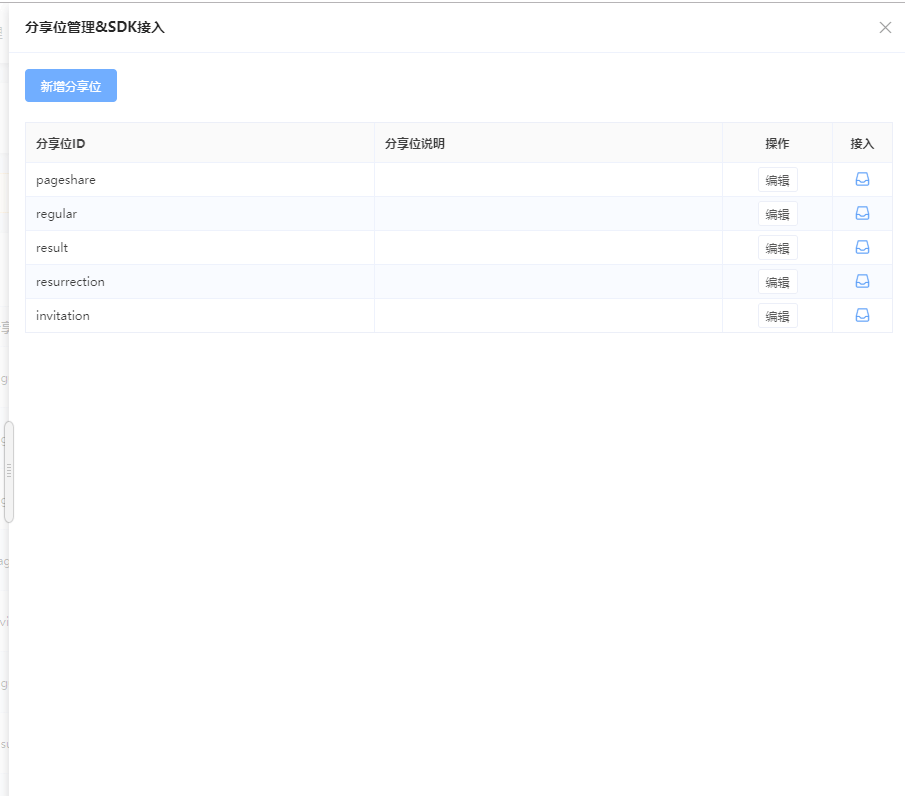

# 分享素材配置

## 概述

本篇为转发素材配置的功能说明，开发说明请参阅：[分享素材配置-开发说明](../dev-guide/sharing/)

## **分享位**

同一小程序/小游戏中，不同位置/功能下的分享，需要配置不同的内容。

天幕中，将这些位置/功能作为不同的分享位进行管理。

一款小游戏中的分享场景举例：

| 分享位 | 说明 | 分享位ID |
| :--- | :--- | :--- |
| 右上角分享 | 用户点击右上角...发起分享 | initiative |
| 首页邀请 | 在首页邀请好友 | indexInvite |
| 结束页邀请 | 死亡后邀请好友比拼 | gameoverInvite |
| 战绩分享 | 获得历史最高分后炫耀战绩 | highscore |

## 使用说明

### 配置分享素材

每个转发素材需指定对应的分享位，随后设置分享文案和素材即可。

### **分享位管理**

点击页面的“分享位管理&接入”，进行分享位的管理

## 接入

请在“分享位管理&接入”中，点击每个分享位最右侧的“接入”图标，复制弹窗内容，发送给开发人员

开发说明请参阅：[转发素材配置-开发说明](../dev-guide/sharing/)

