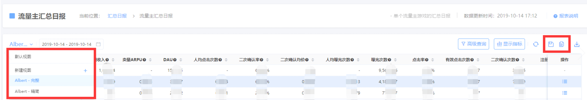

# 自定义视图

## 高级搜索及显示指标

天幕的大部分数据报表中均支持进行“高级查询”和调整“显示指标”

* 高级查询：多种查询条件的**联合搜索**
* 显示指标：选择当前报表的**显示指标**及**指标显示顺序**

每个使用者的所在角色及用户习惯不同，针对数据所做的筛选及展示的指标也不同，每次查看数据都需要重新调整会相当的耗时耗力。

## 自定义视图

自定义视图，可保存当前设定的“高级查询”和“显示指标”，避免每次进行重复设定。

帮助您最快时间筛选出您需要的数据。


自定义视图可保存当前的筛选条件、展示指标及指标顺序，建议使用


利用右侧“另存”按钮将当前配置存为新视图、“保存”按钮更新当前视图的配置；

利用左侧下拉框选择视图。

