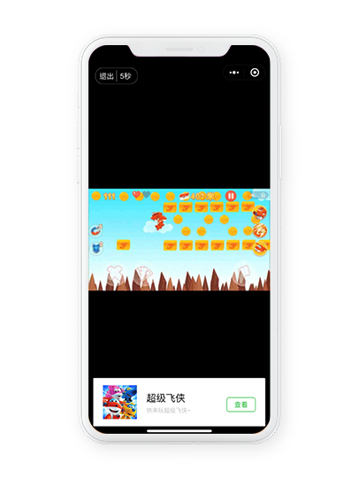

# 名词解释

## 1、主体

类似微信主体的一个抽象概念，建议一个公司下的游戏项目放在同一个主体内进行管理。

## 2、卖量助手


卖量助手：用于对外流量变现，对内交叉互导；提升卖量效率。


### 2.1、流量主游戏

作为流量主的游戏，即卖量的一方。

### 2.2、广告主游戏

作为广告主的游戏，即买量的一方。

一般将广告主游戏分为两类：

1. 外部广告主游戏（简称：外部游戏）：即实际外部的广告主
2. 内部广告主游戏（简称：内部游戏）：内部互导时，向天幕同主体下的其他游戏导量，将对应的游戏成为内部广告主游戏；


广告主游戏区分内部/外部，主要原因为两者带来的收入不同：

1. 只有外部游戏带来的收入才是真金白银。
2. 但给内部广告主的新增同样有价值；内部互导是否进行结算，请根据公司自身需求进行设置。相关名词：[内部结算](glossary.md#6-2-nei-bu-jie-suan)。


### 2.3、创意

推广时所使用的素材，最终表现为用户所看见的推广内容。

创意的类型与广告位类型对应，详见下方广告位介绍。

### 2.4、广告位

用于展示创意，不同类型广告位有不同的展示形式，目前天幕支持以下五种广告形式：

#### 类型1、多icon广告位（常用）

一次性展示多个创意；

创意尺寸：200\*200；支持组件和API接入。

#### 类型2、浮动窗

类似icon挂件的形式，可展示静态图片，或是通过多帧轮播实现类似gif的动态效果； 

一次性只展示一个创意，每10s自动切换，点击后切换展示创意；

创意尺寸：190\*270；支持组件和API接入。

#### 类型3、伪视频

类似微信的激励视频广告，使用多帧图片轮播的方式实现视频效果；

创意尺寸：960\*540；仅支持组件接入。

#### 类型4、插屏广告 

效果同常见的插屏广告；

创意尺寸：780\*960；仅支持组件接入。

#### 类型5、天幕banner广告

类似微信的banner广告，常用作微信banner失效后的替代；

创意尺寸：960\*334；仅支持API接入。

### 2.5、曝光次数

创意的展示次数，注意只要前端加载创意即算作曝光一次

### 2.6、点击次数

创意被点击的次数

### 2.7、二次确认次数

小游戏/小程序跳转时，点击确认框中的确认按钮后，才可跳转，点击该确认按钮次数即为二次确认次数

### 2.8、新增注册数

从流量主游戏跳转到广告主游戏的新增注册人数

分为两种情况：

1. 内部互导注册：广告主游戏在当前天幕主体内，自动计算（需接入SDK“[登录](https://doc.skysriver.com/game-data/dev-guide/deng-lu)”功能）
2. 外部结算注册：除上述情况外，需在“游戏收支——卖量收入管理”中上传结算注册人数（[强烈建议上传](https://doc.skysriver.com/selling/creative-strategy#4-wei-shi-mo-jian-yi-shang-chuan-shou-ru)）

### 2.9、卖量收入

通过卖量获得的收入（不包括微信官方广告的收入）；分为两种情况（同上方“新增注册数”）：

1. 内部互导收入：
   1. 广告主游戏在当前天幕主体内，自动计算；
   2. 需在“控制台——主体设置——内部结算配置”中进行设置；
   3. 当有内部结算需求时可使用此功能，此部分收入默认为0
2. 外部结算收入：除上述情况外，需在“游戏收支——卖量收入管理”中上传结算收入（[强烈建议上传](https://doc.skysriver.com/selling/creative-strategy#4-wei-shi-mo-jian-yi-shang-chuan-shou-ru)）

## 3、买量助手


买量助手：用于渠道监控，追踪买量的效率，提高投放ROI


### 3.1、投放产品

对外买量时投放的游戏

### 3.2、渠道商及媒体

通常所说的渠道在天幕中分为上下两级进行管理：**渠道商——媒体**

1. 渠道商：通常为被购买流量的公司/团队
2. 媒体：通常为该渠道商下的某个小游戏

一条渠道即对应着xx渠道商下的xx媒体


当进行内部互导时，天幕会自动创建一条渠道码，并在卖量助手中自动填入该渠道码，无需手动创建。


### 3.3、渠道ID及跳转路径

一个天幕渠道ID，对应一条渠道，即对应的渠道商和媒体

主要作用：

1. 渠道的数据统计
2. 在渠道投放中，需保证用户从**媒体**跳转到**投放产品**时，path路径中填写了包含该渠道ID的链接，示例：`page/index/index?channelCode=123456`
3. channelCode为天幕渠道的标识，123456为渠道ID，两者缺一不可


注意：跳转时，不填写渠道ID，会导致买量助手中无法统计到该渠道的数据


### 3.4、渠道监控

天幕提供了每个渠道留存，时长，用户LTV，交叉推广等数据用于渠道质量分析

### 3.5、买量成本

每个跑量中渠道每天所花费的成本；分为两种情况：

1. 内部互导成本：
   1. 内部互导时，自动计算；
   2. 需在“控制台——主体设置——内部结算配置”中进行设置；
   3. 当有内部结算需求时可使用此功能，此部分成本默认为0。
2. 外部买量成本：除上述情况外，需在“游戏收支——买量成本管理”中上传买量成本。

## 4、游戏数据


游戏数据：全面深度的游戏数据


### 4.1、PV和UV

PV：访问次数

UV：访问人数，因微信本身机制限定，UV的去重只能精确到单个游戏，无法跨游戏UV去重


跨游戏的UV值均为直接相加


### 4.2、活跃、新增及访问

活跃用户数：进入小程序或者小游戏的**用户数**，同一用户同一天多次访问不重复记录

新增用户数：首次登录小程序或者小游戏的**用户数**，同一用户同一天多次访问不重复记录

访问次数：用户访问小程序或小游戏的**次数**

访问次数&gt;活跃用户数&gt;新增用户数

### 4.3、裂变K值

病毒传播系统，用于衡量产品的裂变能力

计算公式为：分享引入新增用户/（活跃用户数-分享引入新增用户）

### 4.4、游戏收入

游戏数据模块中的收入数据，及收入相关的ARPU等指标，仅包含**官方广告收入**（官方Banner广告、激励视频、插屏广告）及**内购收入**（内购统计功能测试中，暂不开放），**不包含任何卖量的收入**。


查看游戏全部的收入/支出及毛利，请在“游戏收支”中查看。


### 4.5、交叉推广

使用天幕卖量助手，基于小游戏跳转的流量推广体系，统称为交叉推广

其他可见指标的详细说明

## 5、游戏配置


游戏配置：在线管理游戏内容


### 5.1、分享位

所属功能：分享素材配置

1. 类似广告位的概念，把游戏中每个涉及到分享的功能点作为一个分享位进行管理。
2. 可针对不同分享位设置不同的分享素材。
3. 试量：如首页的分享拉新奖励，结算页的分享复活，建议创建两个分享位分别进行管理。

## 6、其他

### 6.1、内部互导

天幕同主体下的游戏利用卖量助手进行导量。

### 6.2、内部结算

内部互导时，可选择是否进行结算：

广告主游戏（推广游戏）：多一笔成本

流量主游戏（媒体）：多一笔收入

详见[内部结算](https://doc.skysriver.com/internal-settlement)说明

