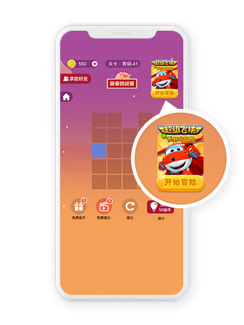

# 天幕浮动窗广告

天幕提供的浮动窗广告是类似icon的广告位，同一个广告位，支持展示静态图与类GIF动态图两种类型的素材，使广告位创意的展示更多样化，得到用户更多的关注。

该广告位需要的素材尺寸为：190\*270

若要配置动态素材图，请根据需要实现的GIF效果，生成一定数量的190\*270素材图片，然后在天幕后台上传即可。

推荐使用组件化的方式接入，具体的接入指南请参考：[接入浮动窗广告位](../ji-shu-zhi-nan/zhu-jian-hua/createflow/icon.md)

