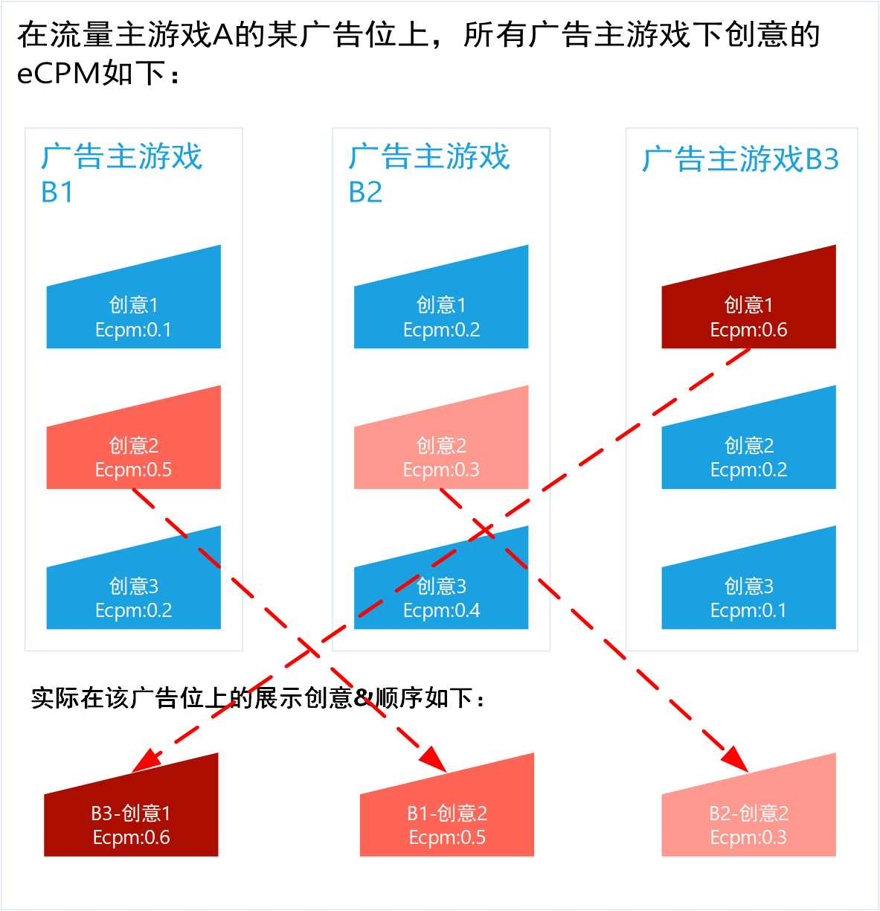

# 天幕创意下发策略

## 1、概述：基于eCPM的竞价排名

目标：提高卖量效率，保证eCPM高的推广游戏，获得高数量、质量的曝光

高数量即高曝光频次，高质量即靠前的展示顺位


**Max 效率= Max Σ\[（每个广告主游戏eCPM \* 对应的曝光数\)/\(DAU \* 1000）\]**


## 2、策略：创意的下发及顺序


1. STEP1 - 单广告主游戏内部排序：每个广告主游戏取**eCPM最高**的那个创意 
2. STEP2 - 多广告主游戏整合排序：多个广告主游戏eCPM最高的创意，再进行排序后，为最终广告位上展示的创意及顺序


**示例说明：**

在流量主游戏A上

共有**3个**广告主游戏B1、B2、B3，每个广告主游戏各有3个创意：

> {B1-创意1，B1-创意2，B1-创意3}
>
> {B2-创意1，B2-创意2，B2-创意3}
>
> {B3-创意1，B3-创意2，B3-创意3}

这9个创意在**某个广告位**上的eCPM分别为：

> 广告主游戏B1:｛0.1，**0.5**，0.2｝
>
> 广告主游戏B2:｛0.2，0.3，**0.4**｝
>
> 广告主游戏B3:｛**0.6**，0.2，0.1｝

则：

实际在**该广告位上**展示的创意数量为**3个**（每个广告主游戏只展示eCPM最高的创意），

展示顺序为：B3-创意1（eCPM：0.6），B1-创意2（eCPM：0.5），B2-创意3（eCPM：0.4）

**说明：**

eCPM相同时，进行随机处理

## 3、eCPM计算规则

### 3.1、计算步骤


1. 试量：每个新的创意，在每个广告位上，都会获得一定曝光量的置顶展示机会 
2. 竞价排名：根据试量阶段的结果，计算eCPM，参与上述的创意排序 


**说明：**

eCPM是针对每个广告位-创意单独计算的，即同一个创意在不同广告位上的eCPM不一定相同，同一个广告位上不同创意的eCPM不一定相同。

### 3.2、计算公式


eCPM = 点击数\*点击价格/曝光数\*1000\*校正值L = CTR\*点击价格\*1000\*校正值L


1\) 曝光数、点击数为接入天幕广告位后，自动统计的数据

2\) **点击价格目前全局默认为0.1（暂不支持修改）**

3\) L为校正值，默认为1，如果在**卖量助手——收入管理**中上传了收入数据则：

针对该流量主游戏-广告主游戏

取最近的收入不是N/A的一天（未上传收入数据为N/A）


校正值L = 此一天的总收入/（此一天总点击数\*点击价格）


### **3.3、如何理解校正值L**

在未上传收入的时候，天幕只能拿到点击相关的数据，故以**点击率CTR**为核心，进行eCPM的计算

当上传了实际的收入时，则应将从**点击到最后实际收入的转化率**纳入eCPM的计算中，L所表示的就是此转化率。

**L计算举例：**

**今天为9月28日**，在卖量助手中上传了如下收入数据：

在**流量主游戏A**上，**广告主游戏B**的：

9月28日的收入数据、9月26日的收入数据（未上传9月27日收入数据）

则此时：

校正值L = 9月26日的总收入/（9月26日的总点击数\*点击价格）

在计算**广告主游戏B**的全部创意在**流量主游戏A**上所有广告位的eCPM时，都会乘上述L值

**说明：**

当天（9月28日）上传的数据不会立即生效（当天9月28日还没过完，上传的收入必然不完整，故不会作为计算的依据）

## 4、为什么建议上传收入

通过上述L值的计算过程，可以得知**：**

上传收入后，eCPM的计算将更加准确——从**点击到最终收入转化效率更高**的广告主游戏，将会获得更高更好的曝光机会，这将会进一步提高卖量效率。


根据实际的实验结果，上传收入后卖量效率**可提高5%-30%**

为进一步提高卖量效率，我们强烈建议您上传历史收入数据


