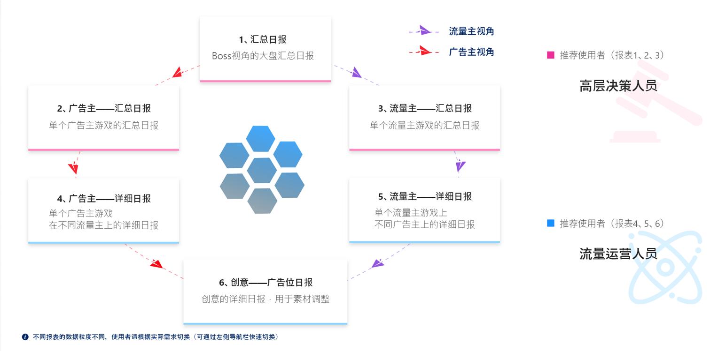

# 数据报表

## 概述

卖量助手提供了多维度的数据表格，不同维度报表数据粒度不同，请根据实际需求查看。


在2019/09/15的版本中，天幕新增了一个报表——“广告位日报”：

1. 查看广告位的每日汇总数据
2. 主要用于广告位曝光策略优化


## 自定义视图

可以将当前报表的搜索条件&展示指标（及指标展示顺序）保存为自定义视图

只需切换视图，无需重复设定搜索条件、展示指标，以达到高效筛选数据的目的

详情请参阅：[自定义视图](../../general-function/customized-view.md)

## 多维度报表

### 1、汇总日报

汇总日报为当前主体的**每日汇总数据**。

### 2、流量主汇总日报

以流量主的角度来展示当前主体下的**流量主游戏**数据概况，可查看每个**流量主游戏**的总体情况。

### 3、广告主汇总汇总

以广告主的角度来展示当前主体下的**广告主游戏**数据概况，可查看每个**广告主游戏**的总体情况。

### 4、流量主详细日报

可查看单个流量主游戏的数据表现情况，推荐使用【高级查询】与【显示指标】功能，可快速进行数据查看与分析。

### 5、广告主详细日报

查看广告主游戏在不同流量主游戏上的数据表现情况，推荐使用【高级查询】与【显示指标】功能，可快速进行数据查看与分析。

### 6、创意详细日报

对流量主下的所有游戏进行集中管理，总览所有流量主上在跑的广告主游戏创意的数据情况，天幕会根据创意在线上跑量的数据表现情况，给出相应的优化建议，可用于决策参考。

具体参考的说明如下：

系统通过比较分析“当前创意”与”当前流量主游戏上的全部创意”的历史汇总数据，给出此系统评价：

> 优：在全部创意中吸量程度顶尖暂时无需优化 
>
> 良：在当前广告主游戏的创意中顶尖，可保留此创意，视情况继续优化
>
> 差：吸量程度较差，建议删除，尝试新的创意 
>
> 待观察：数据较少，继续观察

此系统评价主要用于参考

### 7、广告位日报

可查看广告位的每日汇总数据，用于指导广告位曝光策略的优化

