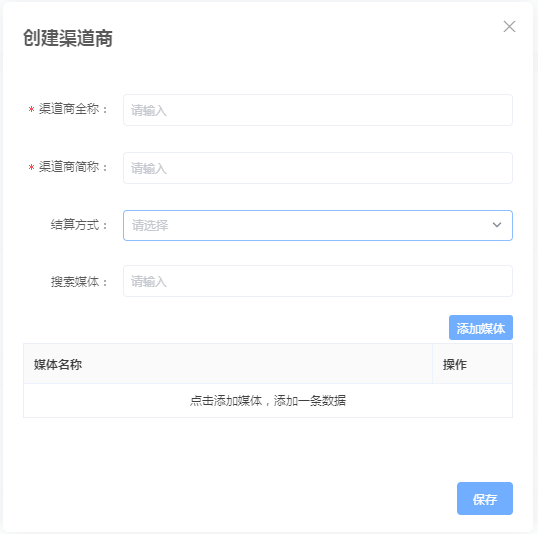

# 编辑广告计划

在广告推广计划已经在进行中时，可能面临以下情况

* 临时更换广告创意素材；
* 修改计划名称，跳转路径等；

可通过编辑广告计划来满足以上需求。

## **1. 查看你创建的广告计划与创意**

在某主体的广告主下的所有广告计划，可以在广告主后台查看。

### **1.1 查看广告计划**

在广告主后台-「投放管理」页面，可查看当前广告主下的所有广告计划。

可通过「推广游戏」「广告计划的状态」「创建日期」来进行筛选。

### **1.2 查看创意**

可以在后台查看所有广告计划中的创意，简单了解创意的曝光情况，详细数据，可在报表页面查看。

## **2. 编辑计划**


注意：已停止的计划，不可编辑。


你可在编辑你的计划广告计划的列表编辑你的计划，见下图：

* 找到需要编辑的计划
* 点击计划名字，即可进入计划的详情页面
* 在详情页面中，可以对计划的「名字」「路径」等信息进行编辑

### **2.1 计划名称与路径**

直接点击编辑按钮，直接在文本框中修改后，点击确定即可。

### **2.2 编辑创意**

如下图，点击操作一栏中的「编辑创意」按钮即可进入编辑状态，编辑完毕后，点击「保存」按钮即可。

