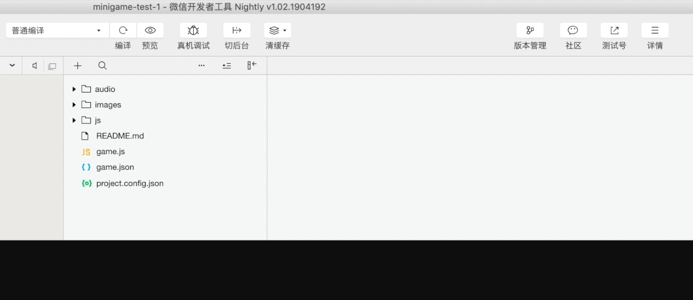

# 技术指南

本篇将说明如何接入天幕SDK，若要使用游戏数据功能，需接入天幕的SDK。

在接入天幕SDK前，请先[注册天幕账号](https://www.skysriver.com)，进入控制台页面时，会看见主体，请进入【游戏管理】后台，为主体添加游戏。

流程共有两个步骤，十分钟左右即可搞定SDK接入。

## **下载SDK**

点击操作中的【下载/接入SDK】开始接入，请按要求配置微信的域名白名单，非常重要，务必添加。

确认添加完毕后，点击下一步。

#### 注意：

* 请按页面流程完成SDK的下载；
* 请勿多个游戏使用同一个SDK，每个游戏会对应一个单独的SDK；

## **接入SDK**

将下载的sdk文件放置到小游戏工程中，在小游戏game.js中引入SDK，并在需要使用sdk功能的地方调用。

#### 植入方式

1. TypeScript或ES6 JavaScript语法植入方式：import 'tm\_sdk.min.js';
2. ES5 JavaScript使用commonJs规范的植入方式：require\('tm\_sdk.min.js'\);

#### 校验SDK

在植入SDK后，复制屏幕上的检测码，在小程序开发工具中将启动参数设为检测码，并开始编译，天幕将自动检测您的接入是否正常，若您已经设置好参数并完成了编译，请点击“开始检测”按钮进行检测接入状态，即可了解SDK接入是否正常。

编译的操作流程如下：

#### **注意：**

小游戏引入SDK时必须遵守如下事项：

* SDK必须放在主包中加载，切勿分包加载
* 在laya引擎中，文件名必须为.min.js结尾，否则会导致编译报错

